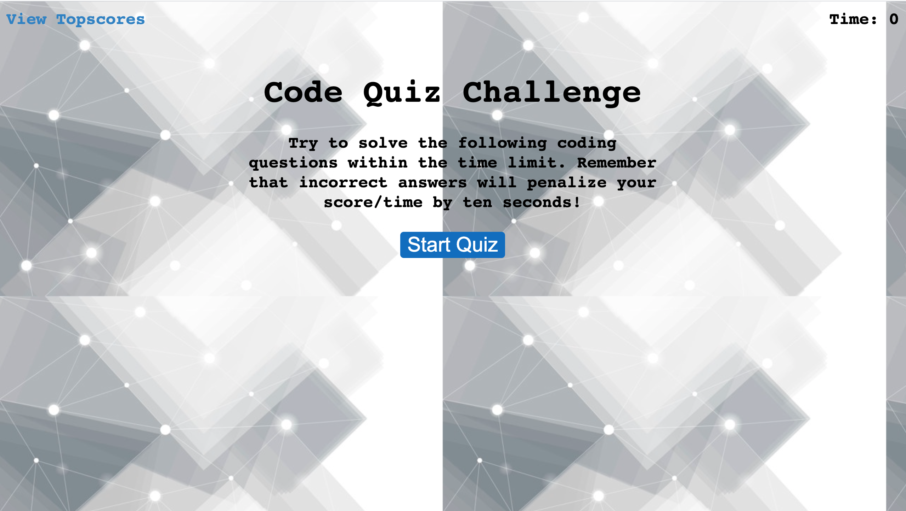

# CodingQuiz

# **License:**
  ### MIT
  

  # **Table of Contents**

  *[Description](#description)

  *[Usage](#usage)

  *[Guidelines](#guidelines)

  
  # **Description:**
  ### This is a coding quiz that that includes multiple choice questions.
   
  # **Usage:**
  ### For this specific project, you will answer multiple choice questions during a set time frame.
  
   
  # **Links:**
  ### https://avmancillas.github.io/Week4HW/
 
  
  

